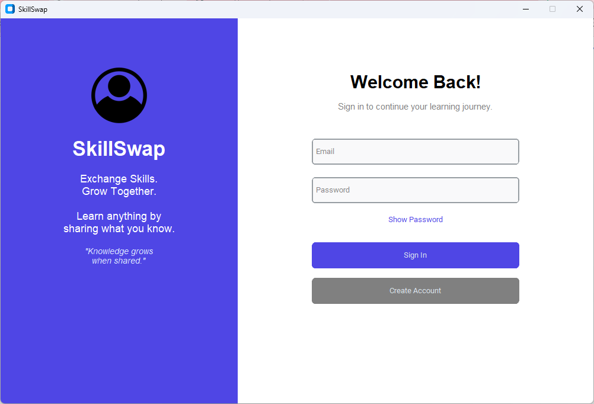
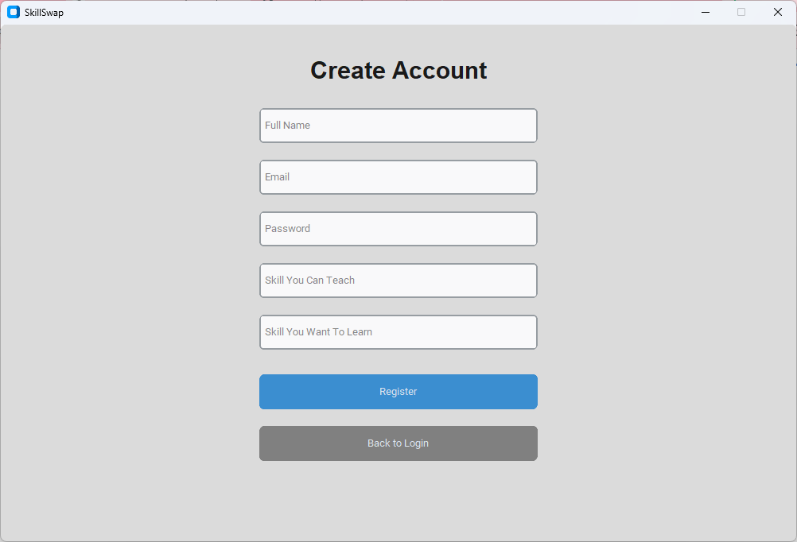
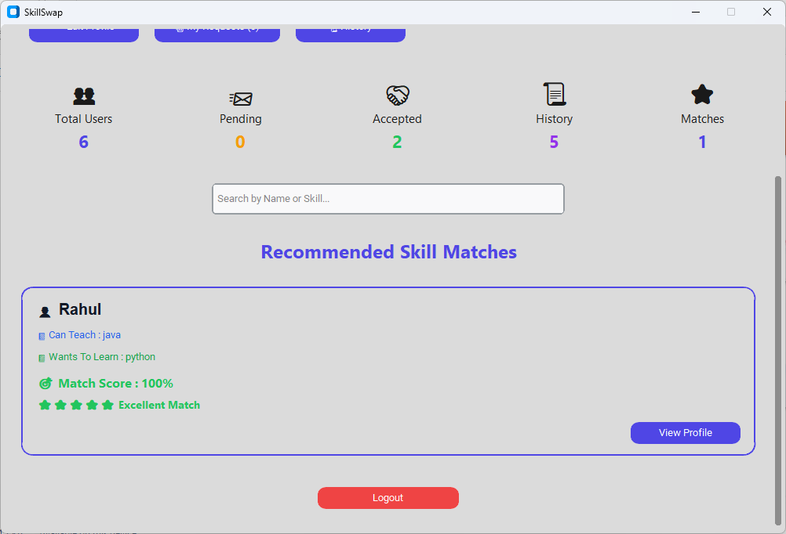
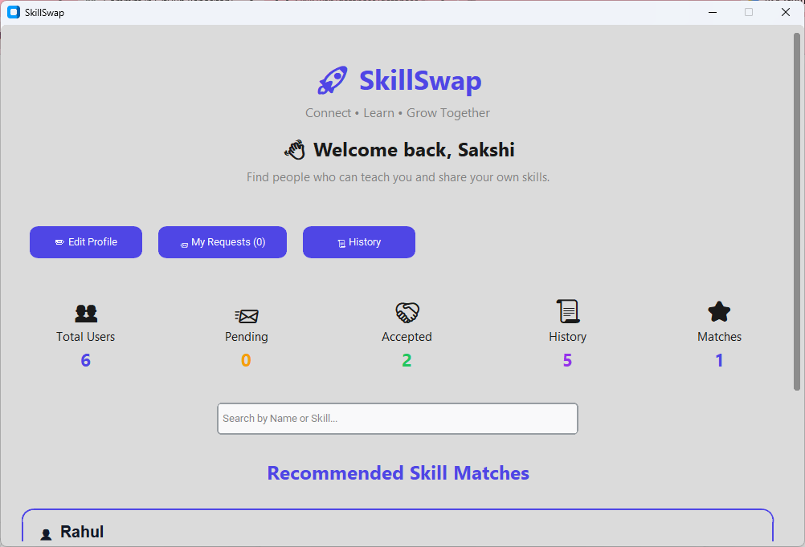
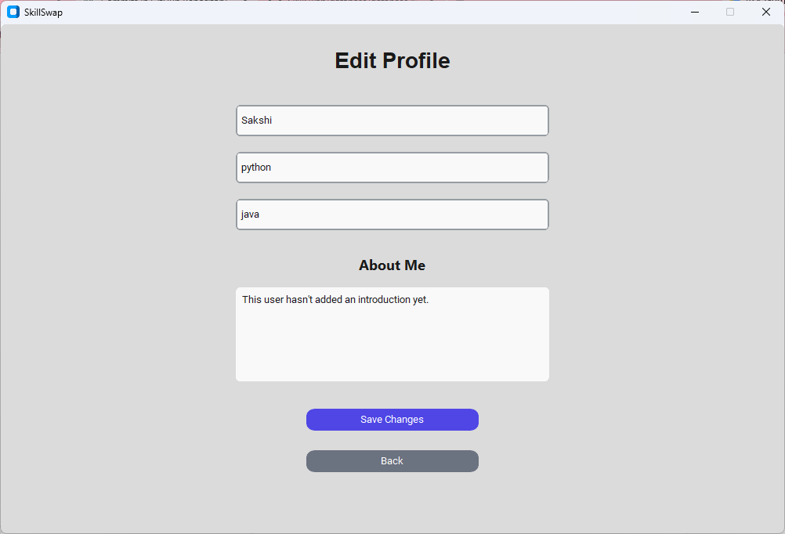
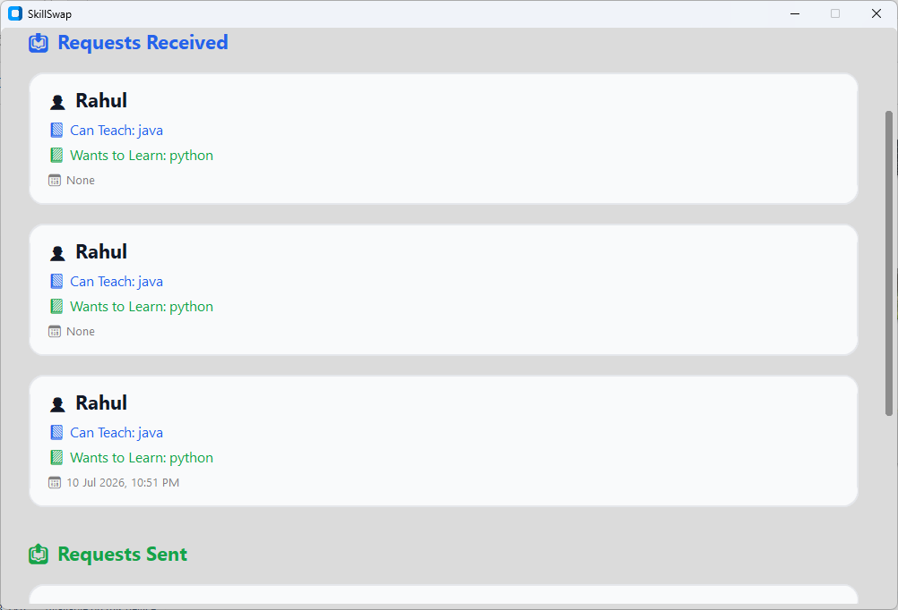

# SkillSwap

A modern desktop application that connects people who want to **teach** and **learn** new skills. SkillSwap enables users to create profiles, discover others based on skills, send learning requests, and manage their learning journey through a clean and intuitive interface.

---

## Features

* User Registration and Login
* Edit Personal Profile
* Add Skills You Can Teach
* Add Skills You Want to Learn
* Search Users by Skill
* View User Profiles
* Send Skill Exchange Requests
* Manage Incoming Requests
* View Request History
* Modern and User-Friendly GUI
* Local SQLite Database Storage

---

## Tech Stack

**Language**

* Python

**GUI Framework**

* CustomTkinter

**Database**

* SQLite3

**Libraries Used**

* CustomTkinter
* Pillow (PIL)
* sqlite3

---

## Project Structure

```text
SkillSwap/
│
├── Assets/
│   └── icons/
│
├── database/
│   └── database.py
│
├── screens/
│   ├── login.py
│   ├── register.py
│   ├── dashboard.py
│   ├── profile.py
│   ├── edit_profile.py
│   ├── requests.py
│   ├── history.py
│   └── splash.py
│
├── main.py
├── theme.py
├── requirements.txt
└── README.md
```

---

## Installation

### Clone the repository

```bash
git clone https://github.com/sakshi-1108/SkillSwap.git
```

### Move into the project folder

```bash
cd SkillSwap
```

### Install dependencies

```bash
pip install -r requirements.txt
```

### Run the application

```bash
python main.py
```

---

## Screenshots

# 🖥️ Application Preview

## Login Screen


## Registration Screen


## Dashboard


## User Profile


## Edit Profile


## Requests


## Request History


## Future Enhancements

* Profile picture upload
* Skill recommendations
* Chat system
* Notifications
* Dark mode
* Password recovery
* Online database support
* User ratings and reviews

---

## Learning Outcomes

Through this project, I gained hands-on experience with:

* GUI development using CustomTkinter
* SQLite database integration
* CRUD operations
* User authentication
* Modular Python programming
* Event-driven application development
* Git and GitHub version control

---

## Author

**Sakshi Yadav**

GitHub: https://github.com/sakshi-1108

LinkedIn: https://www.linkedin.com/in/sakshi-yadav-b45328351

---

## License

This project is developed for educational and learning purposes.
